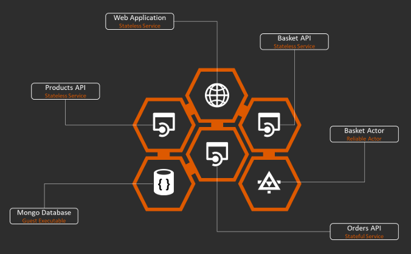

# Service Fabric, Hands-On

This repository contains Service Fabric applications that utilises a variety of different service types, state and API to demonstrate
various features of the Service Fabric platform and an example microservice architecture.

## High Level 

## Components
1. Database
1. Products API
1. Basket API and Actor
1. Orders API
1. Web Application

### Database
The database is a MongoDB **Guest Executable** service that acts as a simple data repository. This is great for local development but ideally 
a PaaS service (e.g. hosted MongoDB or CosmosDB) would be used instead with proper disaster recovery enabled.

### Products API
A simple **Stateless Service** that performs CRUD operations against the database. The connection details are saved in the **Config** settings
deployed with the service so can be updated independently during a delta deployment.

### Basket API and Actor
The API is another **Stateless Service** that hands off the request to a **Reliable Actor** for the specified **Basket ID**. This pattern
allows state to be held in a lightweight service designed for massive scale but with a limited lifetime. The actor itself can be extended
to allow baskets to timeout, or to persist data in a permanent store on deactivation and to reload on activation.

### Orders API
This API is a **Stateful Service** where the API accepts orders and queues these in a **Reliable Queue** collection. A worker thread then 
dequeues these orders and updates the database. Again, the **Config** settings are utilised by this service for delta upgrades. 

### Web Application
The web application is a **Stateless Service** that serves an ASP.NET MVC application. This application provides controllers mapped to each
application making up the overall solution, and these controllers call the relevant API.

## Deployment
The application is deployed as a number of **Service Fabric Packages**. The applications have been aligned to various bound contexts within 
the overall solution (e.g. Products, Basket, Orders) and reduces the impact of upgrading any individual part. 

## Implementing the Solution
In order to implement the solution, there are a number of Lab Sessions detailed below. Each of these will start from a reference branch in 
this repository. Details are shown below:

1. [Lab 1: Creating the Database](docs/Lab1_Database.md)
1. [Lab 2: Creating the Products API](docs/Lab2_Products.md)
1. [Lab 3: Creating the Web Application](docs/Lab3_WebApplication.md)
1. [Lab 4: Creating the Basket API](docs/Lab4_Basket.md)
1. [Lab 5: Creating the Orders API](docs/Lab5_Orders.md)
1. [Lab 6: Creating managed cluster in Azure](docs/Lab6_AzureCluster.md)
1. [Lab 7: Setting up Azure DevOps pipelines](docs/Lab7_AzureDevOps.md)

### Optional
1. [Lab 8: Replace Database guest executable with CosmosDB](docs/Lab8_Optional_CosmosDB.md)