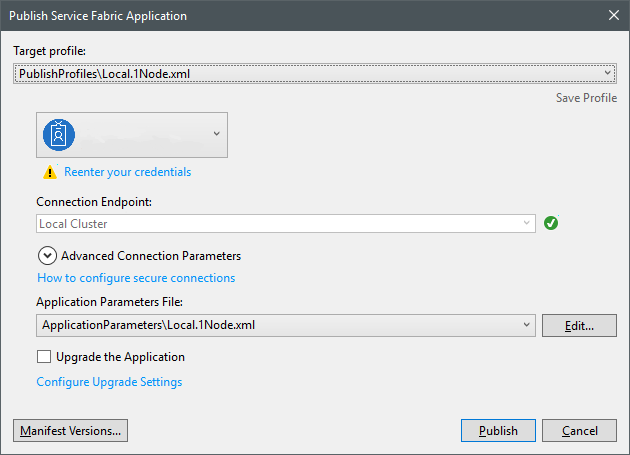

# Creating the Application service
The Application service is a **Stateless Service** that implements an ASP.NET MVC application written
as an ASP.NET Core application to support Mac, Linux and Windows environments.

This service implements an MVC application that obtains its data from the Products microservice as deployed
in [Lab 2](Lab2_Products.md).

## Get the code
Execute the following command in the root directory of this repository:

```
git checkout application
```

## Review the service
This service is an MVC application that provides a UI over the Products microservice. This implements
simple views for the CRUD operations which are routed through to the microservice API.

### Edit Startup.cs
In order to call the Products API microservice we need an `HttpClient` registered as a dependency that will
be made available to each controller as required.

```csharp
public void ConfigureServices(IServiceCollection services)
{
    services.Configure<CookiePolicyOptions>(options =>
    {
        // This lambda determines whether user consent for non-essential cookies is needed for a given request.
        options.CheckConsentNeeded = context => true;
        options.MinimumSameSitePolicy = SameSiteMode.None;
    });

    services.AddSingleton(new HttpClient());

    services.AddMvc().SetCompatibilityVersion(CompatibilityVersion.Version_2_2);
}
```

### Edit BaseController.cs
To support future development of other controllers we need a base class that provides some basic functionality
for invoking methods on an API. This class will provide this functionality. Within this class there will be a
method provided that resolves the location of a suitable service to handle the request.

```csharp
protected async Task<Uri> GetServiceUriAsync(string application, string service, string path, Func<ServicePartitionKey> partitionKeyGenerator = null)
{
    var resolver = ServicePartitionResolver.GetDefault();
    var partition = await resolver.ResolveAsync(
        new Uri($"fabric:/{application}/{service}"),
        partitionKeyGenerator?.Invoke() ?? new ServicePartitionKey(),
        CancellationToken.None);

    var endpoints = partition.Endpoints
        .Where(ep => ep.Role == ServiceEndpointRole.Stateless || ep.Role == ServiceEndpointRole.StatefulPrimary)
        .Select(ep => ep.Address)
        .ToArray();

    var idx = Interlocked.Increment(ref index) % endpoints.Length;
    var endpoint = endpoints[idx];

    var address = JObject.Parse(endpoint)
        .SelectToken("Endpoints")
        .ToObject<JObject>()
        .Properties()
        .First()
        .Value.Value<string>();

    var uri = new Uri($"{address}{path}");
    return uri;
}
```

### Edit ServiceManifest.xml
The Application service will serve as the entry point into the solution. As such, the Service Fabric port will
be set to the default for HTTP traffic of `80`. When deployed to Azure the default Load Balancer rules already
handle incoming calls to port `80` so this is a sensible setting for this workshop.

```XML
<Endpoints>
    <Endpoint Protocol="http" Name="ServiceEndpoint" Type="Input" Port="80" />
</Endpoints>
```

# Deploying the Service
If you are running Visual Studio then the service can be deployed to a local Service Fabric cluster by right 
clicking the Service Fabric Application in Solution Explorer and choosing the Publish option. This will open 
a dialog that allows the cluster to be selected. By default this will be an Azure cluster but there are also
options for Single and Five Node clusters.



Choose the option that matches your local Service Fabric cluster setup and click Publish. The output will be 
displayed in the Output Window in Visual Studio.

# Testing the Service
Once deployed, open a browser and point to [http://localhost](http://localhost) which should open the default
web page from the `HomeController`. From here click the link to the products view and check the products created
in [Lab 2](Lab2_Products.md) are shown.

Now test the links to Create, Update and Delete items.